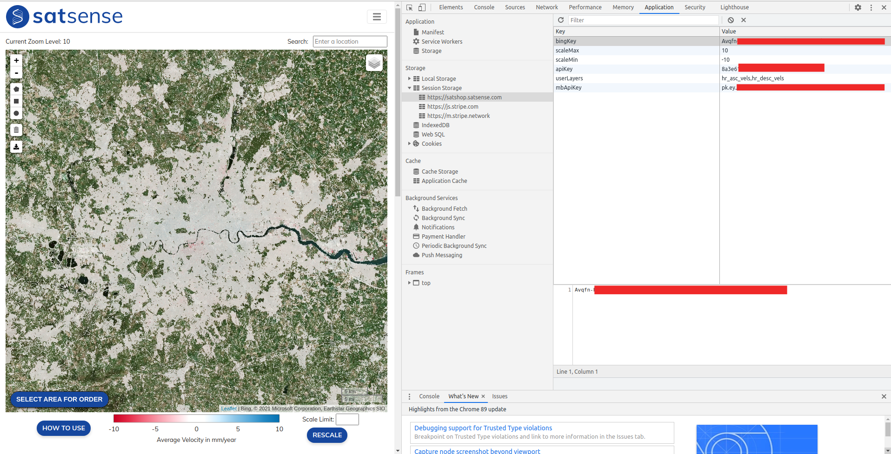

# Integrating Tileservers into QGIS (fiddle)

Whilst the portal is a useful tool, it doesn't currently match the feature-rich environment that QGIS provides.  Here, we detail how to integrate the [satsense tileservers](tileservers.md) into QGIS. These instructions were written for QGIS 3.4, but they should be transferable to other versions.

The idea is to add a new "XYZ Tiles" connection to QGIS, and this connection will contain details of the tileserver that the portal plugs into.  We first give a general overview of how to add a new "XYZ Tiles" connection and then this will motivate the parameters we need to find from the portal.

# Adding a new "XYZ Tiles" connection into QGIS

Make sure the "Browser" panel is open, if not you can open by clicking "View" -> "Panels" -> Check "Browser".

In the "Browser" panel, right click "XYZ Tiles" and click "New Connection", as seen here:


This will open a window much like the following:


In the above image:

* The "Name" can be anything you want (although I would recommend making it descriptive);
* The "URL" is the url of the tileserver.  We will discuss the URL for the satsense tileservers in the [next session](#finding-the-url-for-a-satsense-tileserver).
* Sometimes tileservers have some authentication to prevent unauthorised access and that can be set up in the "Authentication" section.  However, for the satsense tileservers, we can safely ignore this section - panic not, the tileserver is protected by api keys contained in the url (as you shall see).
* Hopefully the "Min/Max Zoom levels" are fairly self-evident. The portal uses a Min Zoom level of 0 and a Max Zoom level of 19.  

# Finding the url for a satsense tileserver

For the tileserver that provides tiles for the site `https://satshop.satsense.com`, tileserver urls are:

```
# For ascending data
https://satshop.satsense.com/tiles/hr_asc_vels/{z}/{x}/{y}.png?access_token=ThisIsAnAccessToken&scale_min=-10&scale_max=10

# For descending data
https://satshop.satsense.com/tiles/hr_desc_vels/{z}/{x}/{y}.png?access_token=ThisIsAnAccessToken&scale_min=-10&scale_max=10
```

However, the reader will need to find their access token (which will not be equal to the value `ThisIsAnAccessToken` suggested above). Currently, there is no user-friendly way to do this, but we will now go into some detail in how to obtain the access token. 

First, log into the [satshop/portal](https://satshop.satsense.com/portal). Your access token will now be stored in [session storage](https://developer.mozilla.org/en-US/docs/Web/API/Web_Storage_API).  Session storage is a bit like cookie storage except that the data is never transferred to a server, and it is deleted when the browser/tab is closed.  Most modern browsers allow easy access to values in their session storage. We detail how to see session storage for firefox and chrome - other browsers should provide a similar mechanism. 

In both of the following examples, we've redacted any sensitive values.  In these examples, the reader is looking for a value starting with "8a3e..." and whose key is called "apiKey" (we acknowledge that the name "apiKey" is not ideal since we've been calling it an "access token" for some time).  The reader's own access token ("apiKey") is unlikely to start with "8a3e...".

## Firefox

* Right click anywhere on the portal page that isn't interactive (e.g. a button, leaflet map etc).
* Click "Inspect Element" from the menu.
* The "developer tools" should open. The reader is looking for a tab called "Storage", for which they might need to press the arrows >>.
* Open "Session Storage" and click "https://satshop.satsense.com".

The reader should see something like this:


## Chrome

* Right click anywhere on the portal page that isn't interactive (e.g. a button, leaflet map etc).
* Click "Inspect" from the menu.
* The "developer tools" should open.  Click the tab "Application".
* Under the "Storage" section, open "Session Storage".
* Click "https://satshop.satsense.com"

The reader should see something like this:


# Final Notes

Once the reader has found their session token, they can replace the string "ThisIsAnAccessToken" with their token in the urls suggested at the start of [the previous section](#finding-the-url-for-a-satsense-tileserver).  One of these urls (depending one whether you want ascending or descending data) then goes into "URL" section when adding a [new connection to QGIS](#adding-a-new-xyz-tiles-connection-into-qgis).  If you want both ascending and descending data, you should add two connections.  

Once the connection has been created, the reader can add it to their project by right clicking their created connection in the "Browser" panel and then clicking "Add Selected Layer(s) to Canvas". See the following screenshot:


We finish on the note that one can change the "scale" (in the same meaning as the colour bar in the portal), by altering the values for "scale_min" and "scale_max" in the urls.
